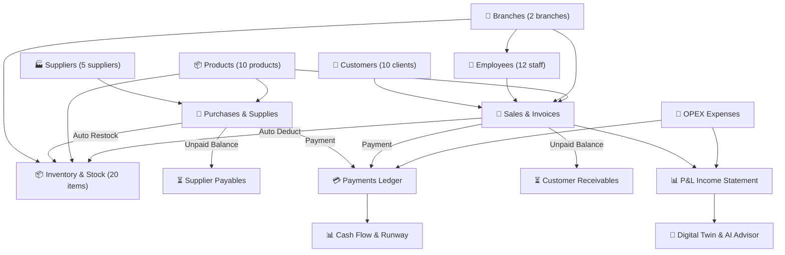

# Business Digital Twin — Enterprise Multi-Tenant SaaS Platform

[](https://opensource.org/licenses/MIT)
[](https://dotnet.microsoft.com/)
[](https://nextjs.org/)
[](https://fastapi.tiangolo.com/)
[](https://www.postgresql.org/)
[](https://scalar.com/)

**Business Digital Twin** is an executive-grade SaaS platform that constructs a high-fidelity digital mirror of a real enterprise business. It stores interconnected company data (revenue, direct product costs, OPEX, 2 branch networks, 12 staff, 10 customers, 5 suppliers, purchases, debt receivables/payables, payments ledger) and enables founders, CFOs, and executives to simulate **"what-if" strategic scenarios** (price changes, branch expansion, hiring, marketing investments) in an isolated calculated sandbox **without ever mutating real business records**.

---

## 🌟 Core Enterprise Modules

| # | Module | Description |
|---|---|---|
| **1** | **Authentication & IAM** | JWT + Refresh token rotation, BCrypt hashing, multi-tenant workspace resolution with fail-safe recovery. |
| **2** | **Branches (Filiallar)** | Exactly 2 connected branches (`Markaziy Bosh Do'kon`, `Chilonzor Filiali`), rent costs, staff allocations. |
| **3** | **Employees (Xodimlar)** | 12 staff members across Management, Sales, Logistics, Finance, Technical departments. |
| **4** | **Customers (Mijozlar)** | 10 customers with RFM segmentation (`VIP`, `Regular`, `New`), purchase history, LTV and outstanding debt tracking. |
| **5** | **Suppliers (Yetkazib Beruvchilar)** | 5 suppliers with contact information, purchase history, category tags, and payables tracking. |
| **6** | **Products (Mahsulotlar)** | 10 curated products with SKU, barcodes, categories, cost prices, selling prices, and gross margin analytics. |
| **7** | **Inventory & Movements (Ombor)** | Real-time multi-branch stock levels, low-stock reorder thresholds, and immutable Stock Movements log. |
| **8** | **Purchases (Ta'minot Xaridlari)** | Supplier purchase invoices, multi-item batch receiving, automatic stock increments, and supplier debt generation. |
| **9** | **Sales & Invoices (Sotuvlar)** | Order invoices, multi-item checkout, payment methods, automatic inventory deduction, and customer debt generation. |
| **10** | **Debts Management (Qarzlar & Nasiya)** | Full tracking of Customer Receivables and Supplier Payables with settlement modal and payment transaction generation. |
| **11** | **Payments Ledger (To'lovlar Jurnali)** | Complete cash book with Inflows, Outflows, Net Cash Flow, transaction references, and payment methods. |
| **12** | **Expenses (Xarajatlar)** | Categorized OPEX (Rent, Salaries, Marketing, Utilities, Software, Logistics), recurring cost models. |
| **13** | **Financial Reports (P&L & Cash Flow)** | Formal P&L Income Statement with OPEX breakdowns, Cash Flow estimates, Stock Valuation, and CSV export. |
| **14** | **Digital Twin Canvas** | Interactive neural visualization of cash flows, operational nodes, and business dependencies. |
| **15** | **Scenario Simulator** | Multi-variable interactive sandbox with price elasticity, 12-month projections, P10/P50/P90 confidence bounds, CapEx payback horizons, and side-by-side scenario comparison. |
| **16** | **AI Business Advisor** | Dual-engine advisor (LLM integration + Deterministic Statistical Reasoner) in Uzbek, Russian, and English grounded in authorized business data. |
| **17** | **Audit Logs & Security** | Immutable system-wide security audit trails (who modified what, entity diffs, IP tracking). |
| **18** | **Interactive API Documentation** | Modern Scalar API reference (`/scalar`) and Swagger OpenAPI UI (`/swagger`). |

---

## 🏗️ Interconnected Architecture



---

## 🌐 Multilingual (i18n)

Full 100% multilingual interface with zero hardcoded user strings:
- 🇺🇿 **O'zbekcha (Uzbek)**
- 🇷🇺 **Русский (Russian)**
- 🇬🇧 **English**

---

## 🚀 Quick Start

### 1. Clone Repository
```bash
git clone https://github.com/ikromovShahriyor/Business-Digital-Twin.git
cd Business-Digital-Twin
```

### 2. Run Backend (.NET 10 Web API)
```bash
cd backend
dotnet restore BusinessTwin.slnx
dotnet run --project src/BusinessTwin.Api/BusinessTwin.Api.csproj --urls "http://localhost:5000"
```

### 3. Run Frontend (Next.js 15)
```bash
cd frontend
npm install
npm run dev
```

### 4. Access the Application
- **Frontend Web App:** [http://localhost:3000](http://localhost:3000)
- **Scalar API Docs:** [http://localhost:5000/scalar](http://localhost:5000/scalar)
- **Swagger UI:** [http://localhost:5000/swagger](http://localhost:5000/swagger)

**Default Demo Credentials:**
- **Email:** `owner@business-twin.com`
- **Password:** `Admin12345!`

---

## 📜 License

MIT License — feel free to use and customize for your business or organization.
